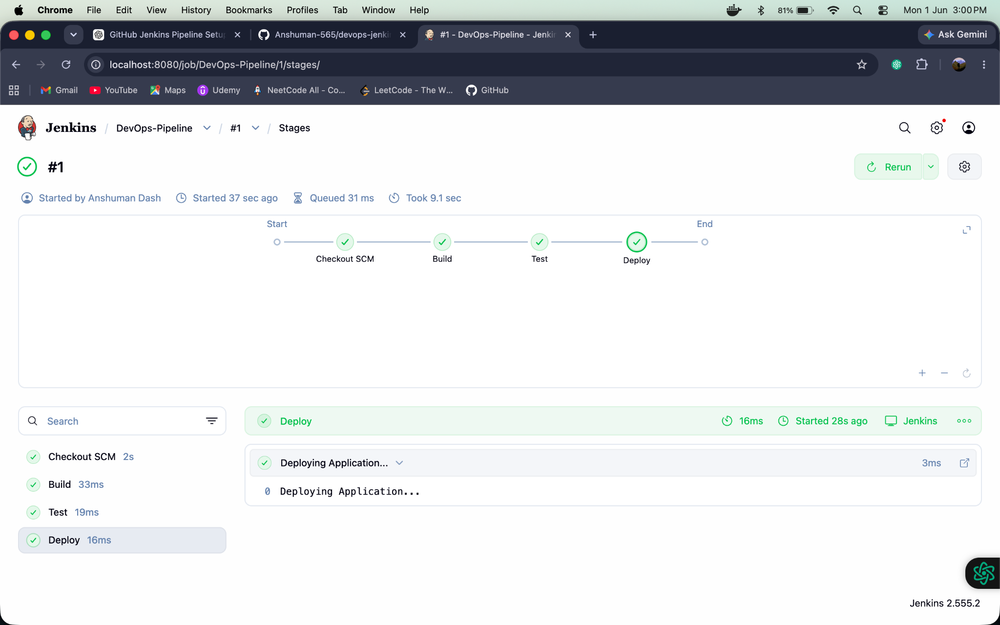
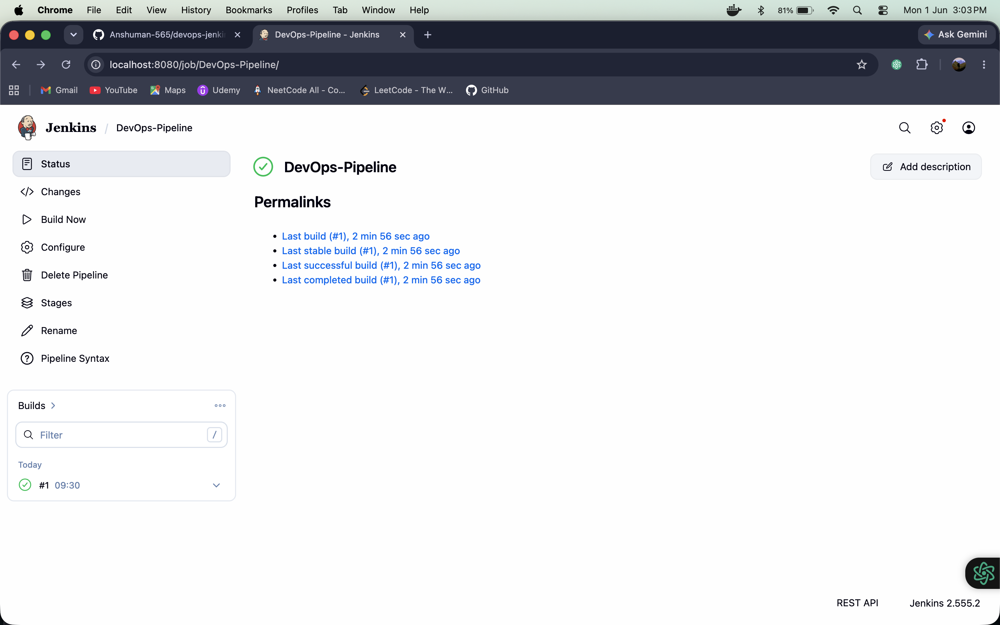
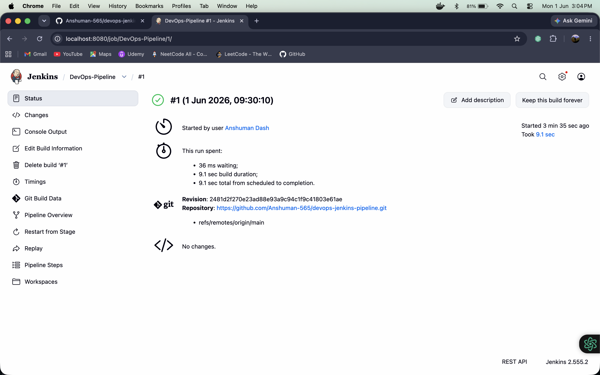
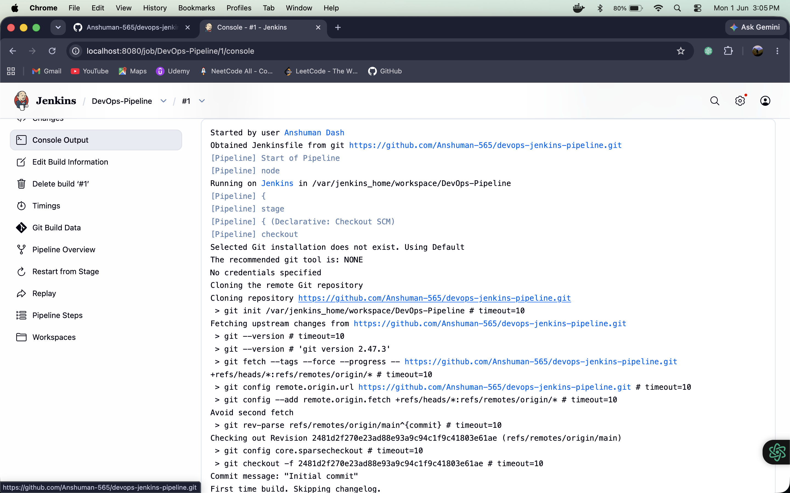
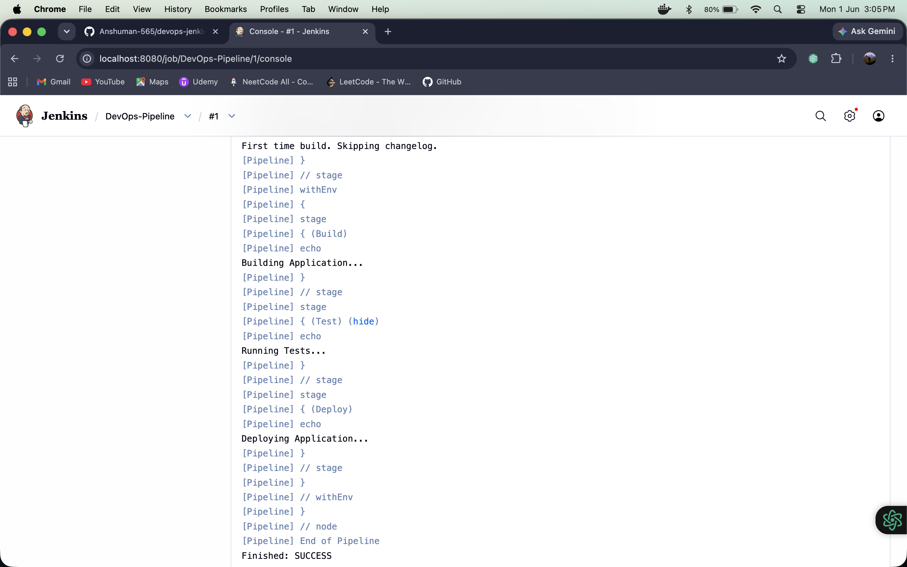

# DevOps Jenkins Pipeline

## Objective
Create a simple Jenkins CI/CD pipeline for a Python application.

## Architecture Diagram

This architecture diagram shows the end-to-end flow of the Jenkins pipeline, the source repository, the build/test/deploy stages, and the simple Python app that is being deployed.

## Control Flow Diagram

This control flow diagram visualizes how the Jenkinsfile executes the pipeline stages in order: Build, Test, and Deploy. It maps directly to the sequential stage structure in `Jenkinsfile`.

## Tools Used
- Jenkins
- Docker
- GitHub
- Python

## Pipeline Stages
1. Build
2. Test
3. Deploy

## Files
- `app.py`
- `Dockerfile`
- `Jenkinsfile`
- `requirements.txt`

## Application Summary
- `app.py` is a minimal Python app that prints a simple message.
- `Jenkinsfile` defines a declarative pipeline with three stages: Build, Test, and Deploy.
- The pipeline is intentionally simple to demonstrate CI/CD flow in Jenkins.

## Pipeline Screenshots

| Screenshot | Description |
|---|---|
|  | Jenkins pipeline execution view or job summary. |
|  | Detailed stage status during the pipeline run. |
|  | Final pipeline completion or deployment result. |

## Outcome
Learned how Jenkins automates CI/CD workflows by running sequential pipeline stages and deploying a Python application.